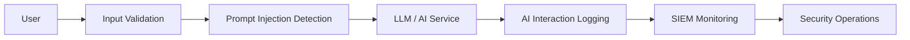

```mermaid
flowchart LR

Dev[Developer] --> GitHub[GitHub Repo]

GitHub --> SAST[SAST Scan]
SAST --> IaC[IaC Security Scan]
IaC --> OPA[OPA Policy Validation]
OPA --> Build[Artifact Build]

Build --> Sign[Artifact Signing]
Sign --> Registry[Container Registry]

Registry --> K8s[Kubernetes Deployment]

K8s --> Runtime[Runtime Security]
Runtime --> SIEM[SIEM Monitoring]
```

# Mr. Mehlek Dawveed

Principal Cloud Security & Sovereign Resilience Architect

Specializing in:
- Sovereign Cloud Security Architecture
- Zero Trust Enterprise Architecture
- Kubernetes & Cloud-Native Security
- AI Security Governance
- IAM / PAM / Identity Federation
- Detection Engineering & SIEM Modernization
- DORA / NIS2 / GDPR Alignment
- Operational Resilience Engineering
- Policy-as-Code Governance
- Multi-Cloud Security Strategy (AWS / MS AZURE / GCP)
- Supply Chain Security (SLSA / SBOM / Sigstore)
- Secure AI Workload Governance

## Featured Projects

### SARTA – Sovereign Adaptive Resilience & Trust Architecture Lab
Enterprise-focused sovereign cloud and operational resilience architecture project aligned with:
- DORA
- NIS2
- GDPR
- ISO 27001
- EU AI Act

## Technologies
AWS • Azure • GCP • Kubernetes • Terraform • OPA • Falco • Splunk • Sentinel

## Certifications
CISSP • CCSP • CRISC • CDPSE • PMP

______________________________________________________________

SARTA – Sovereign Adaptive Resilience & Trust Architecture Lab:
SARTA is a sovereign cloud security architecture and operational resilience lab designed to demonstrate modern Zero Trust, Kubernetes security, AI governance, and policy-as-code controls aligned with emerging EU regulatory and operational resilience requirements.
The project integrates cloud-native security engineering, identity-centric governance, detection engineering, and resilience-by-design principles across multi-cloud and Kubernetes environments.
SARTA is aligned with:
•	DORA (Digital Operational Resilience Act)
•	NIS2 Directive
•	GDPR
•	ISO 27001
•	EU AI Act
•	NIST SP 800-207 (Zero Trust)
________________________________________
Architecture Principles
Zero Trust by Design
Identity-centric security architecture enforcing least privilege, continuous verification, and segmented trust boundaries.
Sovereign Cloud Governance
Support for regional deployment restrictions, data residency enforcement, encryption governance, and sovereign operational controls.
Resilience-by-Design
Operational resilience engineering patterns aligned with DORA requirements for high-availability and regulated workloads.
Policy-as-Code Governance
Continuous enforcement of Kubernetes and cloud security controls using OPA/Gatekeeper and automated CI/CD validation.
Secure AI Adoption
AI governance controls that support prompt injection mitigation, auditability, secure interaction logging, and AI workload segmentation.
________________________________________
Repository Structure
/architecture -> Architecture diagrams and reference models
/docs -> Architecture documentation and governance references
/scenarios -> Threat models and attack scenarios
/compliance-mapping -> Regulatory control alignment documentation
/terraform -> Sovereign cloud landing zone infrastructure
/kubernetes -> Kubernetes security controls and policies
/opa-policies -> Policy-as-code governance controls
/detection-engineering -> Detection logic and monitoring rules
/cicd -> Secure CI/CD pipeline examples
/ai-security -> AI governance and workload protection controls
/resilience -> Operational resilience engineering patterns
________________________________________
Security Domains
Identity & Access Governance
•	Least privilege IAM
•	RBAC enforcement
•	Conditional access
•	Federated identity governance
•	Workload identity architecture
Kubernetes Security
•	Pod Security Standards
•	Runtime security controls
•	Network policy segmentation
•	Admission control enforcement
•	Supply chain protection
Cloud Security
•	Encryption-by-default
•	Sovereign region restrictions
•	Cloud-native segmentation
•	Infrastructure-as-Code governance
AI Security Governance
•	Prompt injection mitigation
•	AI interaction logging
•	Secure AI workload segmentation
•	Input filtering and validation
Detection Engineering
•	Cloud-native telemetry
•	SIEM integration
•	Threat detection logic
•	MITRE ATT&CK aligned detections
________________________________________
Threat Scenarios
•	Kubernetes privilege escalation
•	CI/CD pipeline compromise
•	Identity federation abuse
•	Cloud lateral movement
•	Prompt injection attacks
•	Cross-region sovereignty violations
________________________________________
Compliance Alignment
DORA
Operational resilience engineering, telemetry visibility, governance automation, and incident response alignment.
NIS2
Security governance, risk management, incident handling, and cloud operational controls.
GDPR
Regional data residency, encryption governance, and identity-centric access controls.
EU AI Act
AI governance, AI interaction monitoring, and secure AI workload management.
________________________________________

ARCHITECTURE DIAGRAMS:

Zero Trust Architecture

```mermaid
flowchart LR

User --> IAM[Identity Provider]
IAM --> MFA[MFA Verification]
MFA --> Access[Policy Decision Point]

Access --> AWS[AWS Workloads]
Access --> Azure[Azure Workloads]
Access --> GCP[GCP Workloads]
Access --> K8s[Kubernetes Cluster]

K8s --> OPA[OPA/Gatekeeper]
K8s --> Falco[Runtime Security]

AWS --> SIEM[SIEM/XDR]
Azure --> SIEM
GCP --> SIEM
Falco --> SIEM

SIEM --> SOC[Security Operations]
```

________________________________________
Secure CI/CD Pipeline

________________________________________
AI Security Governance Flow

________________________________________

THREAT SCENARIOS
/scenarios/prompt-injection.md
Threat Scenario: AI Prompt Injection
Scenario Overview
An attacker attempts to manipulate an enterprise AI assistant using crafted prompts designed to bypass governance controls and expose sensitive information.
________________________________________
Attack Path
1.	User submits malicious prompt input
2.	AI model receives instruction override attempt
3.	Prompt attempts data extraction or policy bypass
4.	Sensitive enterprise information exposure risk introduced
________________________________________
Security Risks
•	Sensitive data leakage
•	Policy circumvention
•	AI governance failure
•	Unauthorized information disclosure
________________________________________
Mitigation Controls
•	Prompt filtering and validation
•	Input sanitization
•	AI interaction logging
•	Output filtering
•	Role-based AI access controls
•	Human review workflows
________________________________________
Detection Strategy
•	Monitor abnormal prompt behavior
•	Detect prompt override keywords
•	Log high-risk interaction attempts
•	Alert on repeated policy bypass attempts
________________________________________
Compliance Alignment
•	EU AI Act
•	GDPR
•	DORA operational resilience
/scenarios/k8s-privilege-escalation.md
Threat Scenario: Kubernetes Privilege Escalation
Scenario Overview
An attacker exploits excessive RBAC permissions within a Kubernetes environment to gain elevated cluster privileges.
________________________________________
Attack Path
1.	Compromised workload or credential
2.	Excessive RBAC permissions abused
3.	Cluster-wide administrative access obtained
4.	Lateral movement across workloads
________________________________________
Security Risks
•	Cluster compromise
•	Workload manipulation
•	Data exposure
•	Service disruption
________________________________________
Mitigation Controls
•	Least privilege RBAC
•	Admission control policies
•	Runtime security monitoring
•	Namespace segmentation
•	Network policy enforcement
•	Service account restrictions
________________________________________
Detection Strategy
•	Monitor privileged container creation
•	Detect RBAC modifications
•	Alert on unauthorized kubectl activity
•	Monitor abnormal service account usage
________________________________________
Compliance Alignment
•	DORA
•	NIS2
•	CIS Kubernetes Benchmark
_________________________________________
Future Enhancements:
•	Multi-cloud sovereign landing zones
•	SPIFFE/SPIRE workload identity integration
•	Advanced Kubernetes runtime detection
•	Secure AI model governance controls
•	Resilience simulation exercises
•	Compliance-as-code automation
________________________________________
Author
Designed and maintained as a Cloud Security Architecture portfolio focused on:
•	Sovereign Cloud Security
•	Zero Trust Architecture
•	Kubernetes Security
•	AI Governance
•	Operational Resilience Engineering
•	Policy-as-Code Governance
•	Zero Trust Architecture

