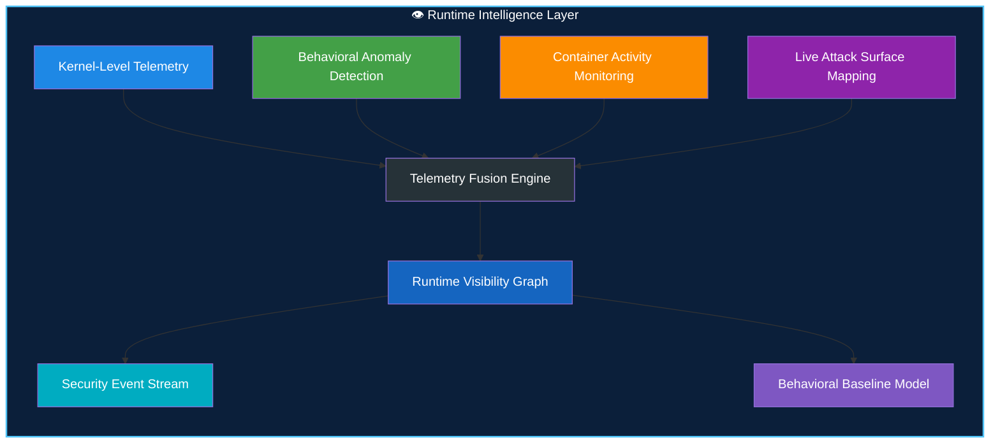
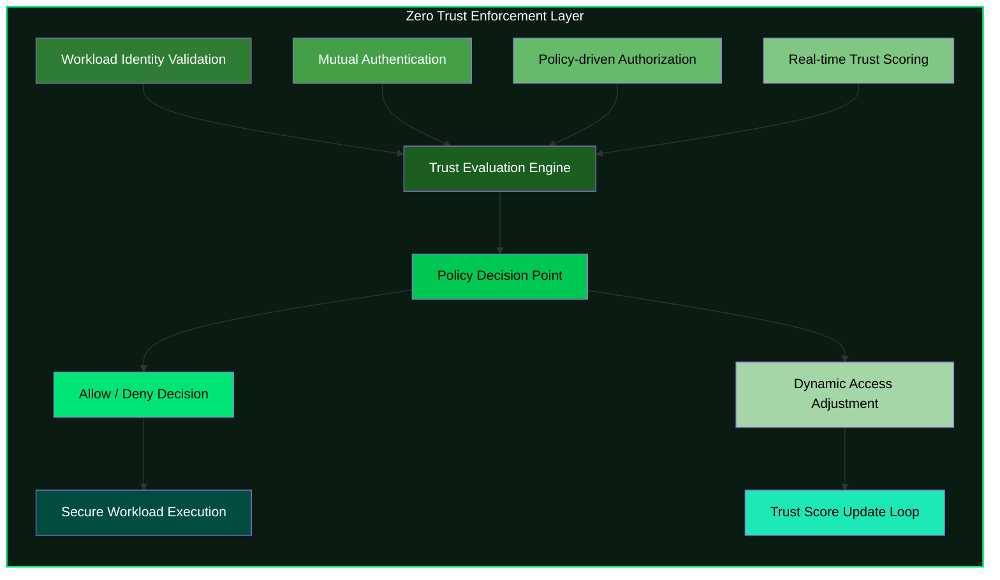
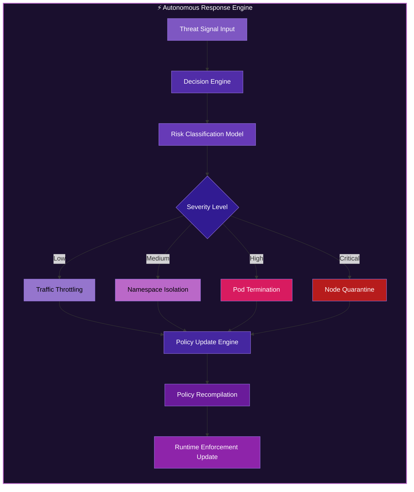
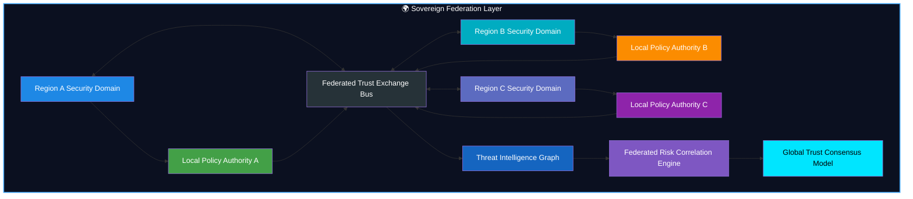
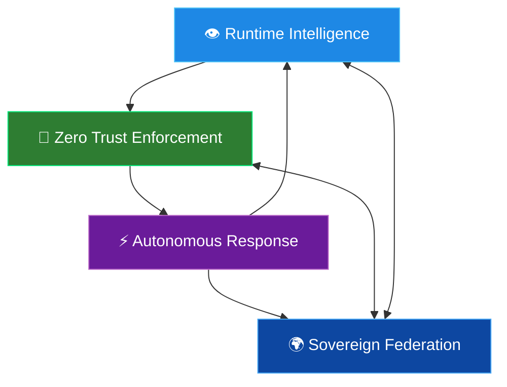

# 🛡️ Sovereign Adaptive Resilience & Trust Architecture (SARTA)

> **A Research Reference Architecture for Autonomous Security, Digital Sovereignty, and Continuous Compliance**


---

## 🌐 Abstract

**SARTA (Sovereign Adaptive Resilience & Trust Architecture)** is a research-grade reference architecture exploring how security, trust, compliance, operational resilience, and digital sovereignty can be implemented as **continuously adaptive computational systems**.

It reframes cybersecurity from a static control problem into a **living autonomous system** capable of sensing, reasoning, and responding in real time.

---

## 🎯 Core Objectives

* 🧠 Advance research into autonomous security systems
* ☁️ Define sovereign Zero Trust cloud architectures
* 🔐 Model compliance as a continuous computational process
* 🤖 Explore AI-assisted security governance
* 🧩 Demonstrate systems architecture & security engineering at research level

---

## 👤 Author, Mr. Mehlek Dawveed

**Principal Sovereign Cloud Security Architect & Researcher**

### Research Domains

* Autonomous Security Systems
* Zero Trust Architecture (Zero Trust Security)
* AI Governance
* Digital Sovereignty
* Cloud Security Engineering
* Distributed Trust Systems
* Continuous Compliance Automation
* Operational Resilience Engineering

---

## 🚦 Project Status

| Area                   | Status         |
| ---------------------- | -------------- |
| Research Framework     | ✅ Complete     |
| Reference Architecture | ✅ Complete     |
| Threat Model           | ✅ Defined      |
| Governance Model       | ✅ Defined      |
| Prototype Systems      | 🚧 In Progress |
| Production Validation  | ⏳ Future Work  |
| Academic Publication   | ⏳ Planned      |

---

## 🧠 Core Idea: Autonomous Security Mesh (v3)

SARTA introduces a shift from fragmented tooling to a unified **Autonomous Security Mesh**:

### 🔄 Continuous Security Loop

```mermaid
flowchart LR

%% =========================
%% CORE LOOP
%% =========================

A[Runtime Telemetry<br/>Kernel + Workload Signals] --> 
B[Risk Engine<br/>Behavioral + Threat Scoring]

B --> 
C[Policy Decision Layer<br/>Policy-as-Code Evaluation]

C --> 
D[Autonomous Response Engine<br/>Mitigation & Containment]

D --> 
E[Identity & Trust Re-evaluation<br/>Continuous Verification]

E --> 
F[Federated Intelligence Sharing<br/>Cross-Domain Threat Learning]

F --> 
B

%% =========================
%% VISUAL STYLING
%% =========================

classDef telemetry fill:#1e88e5,color:#ffffff,stroke:#90caf9,stroke-width:1px;
classDef risk fill:#6a1b9a,color:#ffffff,stroke:#ce93d8,stroke-width:1px;
classDef policy fill:#2e7d32,color:#ffffff,stroke:#a5d6a7,stroke-width:1px;
classDef response fill:#d32f2f,color:#ffffff,stroke:#ef9a9a,stroke-width:1px;
classDef identity fill:#00897b,color:#ffffff,stroke:#80cbc4,stroke-width:1px;
classDef federation fill:#1565c0,color:#ffffff,stroke:#64b5f6,stroke-width:1px;

class A telemetry;
class B risk;
class C policy;
class D response;
class E identity;
class F federation;

%% =========================
%% FLOW EMPHASIS
%% =========================

linkStyle default stroke:#90a4ae,stroke-width:2px;
```



---

## ⚙️ Key Capabilities

### 👁️ Runtime Intelligence

* Kernel-level telemetry
* Behavioral anomaly detection
* Container activity monitoring
* Live attack surface mapping

### 🧠 1. Runtime Intelligence Layer (Sensing & Perception)



---

### 🔐 Zero Trust Enforcement

* Continuous workload identity validation
* Mutual authentication
* Policy-driven authorization
* Real-time trust scoring

### 🛡️ 2. Zero Trust Enforcement Layer (Continuous Verification)



---

### ⚡ Autonomous Response

* Namespace isolation
* Pod termination
* Traffic throttling
* Node quarantine
* Dynamic policy updates

### ⚡ 3. Autonomous Response System (Digital Reflex Layer)



---

### 🌍 Sovereign Federation

* Cross-domain intelligence sharing
* Regional policy autonomy
* Data locality enforcement
* Federated trust propagation

### 🌍 4. Sovereign Federation Layer (Distributed Trust System)



---

## 🧬 Executive Summary

SARTA operationalizes:

* AI-assisted security governance
* Runtime Zero Trust enforcement
* Sovereign multi-cloud control planes
* Federated threat intelligence
* Autonomous incident response
* Policy-as-code enforcement
* Continuous compliance verification
* Digital sovereignty controls

---

### ✨ Master Architecture View (All Layers Combined)



---

## ❓ Why SARTA Exists

Modern security ecosystems are fragmented across:

* SIEM systems
* Identity providers
* Runtime security tools
* Compliance frameworks
* Incident response workflows

### ⚠️ Resulting Problems

* Delayed detection
* Slow response cycles
* Policy inconsistency
* High operational overhead
* Fragmented visibility

SARTA explores whether these can be unified into a **single adaptive computational system**.

---

## 🧪 Research Motivation

Modern infrastructure spans:

* Multi-cloud environments
* Sovereign jurisdictions
* Distributed trust boundaries

Traditional security models remain static and human-driven.

SARTA investigates:

> Can security become a **self-regulating computational organism**?

---

## 🔬 Research Questions

* Can Zero Trust adapt continuously using runtime learning?
* Can compliance become executable code instead of documentation?
* Can sovereign systems share intelligence without losing autonomy?
* What governance is required for AI-driven security decisions?
* Can resilience be continuously verified at runtime?

---

## 🧭 Core Thesis

Security systems should evolve into **digital immune systems**:

* Continuous sensing
* Context-aware reasoning
* Autonomous response
* Policy evolution
* Federated intelligence
* Self-healing behavior

---

## 🧱 Design Principles

* Identity before network trust
* Runtime visibility over assumptions
* Policy as executable logic
* Autonomous response by default
* Human oversight always available
* Sovereignty preserved across domains
* Continuous verification over audits
* Compliance as a runtime property

---

## 🏗️ System Architecture (v3 Autonomous Mesh)

### 🧩 Layered Model

* Identity Layer
* Policy Engine
* Runtime Security Layer
* Autonomy Engine
* Threat Graph
* Observability Layer
* Federation Layer

---

## 🧠 Technology Stack

| Layer         | Technologies                        |
| ------------- | ----------------------------------- |
| Runtime       | Kubernetes, eBPF, Falco             |
| Identity      | SPIFFE, SPIRE                       |
| Policy        | Open Policy Agent (OPA), Gatekeeper |
| Observability | OpenTelemetry, Prometheus           |
| Intelligence  | AI Risk Scoring Engine              |
| Compliance    | Continuous Verification System      |

---

## 🧪 Threat Model

### ✅ Defended Against

* Privilege escalation
* Credential misuse
* Lateral movement
* Supply chain compromise
* Policy drift
* Insider threats

### ⚠️ Partially Addressed

* Advanced persistent threats
* Multi-stage intrusion campaigns
* Federated trust abuse

### 🚫 Out of Scope

* Hardware implants
* Firmware-level attacks
* Physical infrastructure compromise

---

## 🤖 AI Governance Model

### Allowed Actions

* Risk scoring
* Threat classification
* Remediation suggestions
* Policy recommendations

### Forbidden Actions

* Overriding trust roots
* Disabling security controls
* Bypassing policy enforcement
* Autonomous identity modification

> All AI actions remain **policy-bound and human-governed**.

---

## 🧬 Digital Immune System Model

| Biological System | SARTA Equivalent |
| ----------------- | ---------------- |
| White blood cells | Runtime sensors  |
| Brain             | Risk engine      |
| Antibodies        | Policy system    |
| Reflex system     | Response engine  |
| Immune memory     | Threat graph     |

---

## 📁 Repository Structure

```bash
sarta/
├── README.md
├── LICENSE
├── SECURITY.md
├── CONTRIBUTING.md
├── ROADMAP.md
│
├── docs/
│   ├── architecture.md
│   ├── threat-model.md
│   ├── compliance-mapping.md
│   ├── research-roadmap.md
│   ├── publications/
│   ├── diagrams/
│   └── adr/
│
├── control-plane/
├── runtime-security/
├── identity-layer/
├── policy-engine/
├── autonomy-engine/
├── threat-graph/
├── federation/
├── observability/
└── tests/
```

---

## 📊 Compliance Alignment

Aligned with:

* NIST SP 800-207 (Zero Trust Architecture)
* ISO 27001 Security Controls
* GDPR (EU data protection framework)
* DORA (Digital Operational Resilience Act)
* NIS2 Directive
* PCI DSS

---

## 📈 Key Metrics

* Mean Time to Detect (MTTD)
* Mean Time to Respond (MTTR)
* Policy Drift Rate
* False Positive Rate
* Compliance Coverage
* Federation Latency
* Identity Verification Success Rate

---

## ⚔️ Example Attack Response Flow

```text
1. Malicious workload executes
2. Runtime telemetry detects anomaly
3. Risk engine evaluates behavior
4. Policy engine classifies threat
5. Response engine isolates workload
6. Identity trust is recalculated
7. Federation shares intelligence
8. Policies are updated automatically
```

---

## 🧭 Architecture Decision Records (ADR)

Stored in:

```bash
docs/adr/
```

Each ADR documents:

* Context
* Decision
* Alternatives
* Consequences

---

## 🔬 Research Contributions

* Autonomous Security Control Model
* Federated Sovereign Trust Framework
* Continuous Compliance Architecture
* AI Governance for Security Operations
* Digital Immune System Paradigm

---

## 🗺️ Research Roadmap

* Phase 1 — Reference Architecture
* Phase 2 — Prototype Validation
* Phase 3 — Adaptive Policy Systems
* Phase 4 — Sovereign Federation Experiments
* Phase 5 — AI Governance Validation
* Phase 6 — Large-Scale Operational Testing

---

## 🚀 Reproducing the System

### Requirements

* Kubernetes v1.25+
* Linux kernel 5.x+ with eBPF support
* Open Policy Agent
* Falco
* SPIRE

### Deployment

```bash
kubectl apply -f control-plane/manifests/
kubectl apply -f identity-layer/manifests/
helm install falco runtime-security/helm/falco
kubectl apply -f autonomy-engine/manifests/
make demo-run
```

---

## 🤝 Contribution & Governance

* Trunk-based development
* Security-first review process
* Policy change approval workflow
* Architecture review gates
* Severity-based issue triage

---

## 📚 Publications

All research papers and drafts:

```bash
docs/publications/
```

---

## 🧾 Citation

```bibtex
@misc{sarta2026,
  title={Sovereign Adaptive Resilience and Trust Architecture},
  author={Mr. Mehlek Dawveed},
  year={2026},
  version={v3}
}
```

---

## 📜 License

Licensed under the **Apache License 2.0**

---


