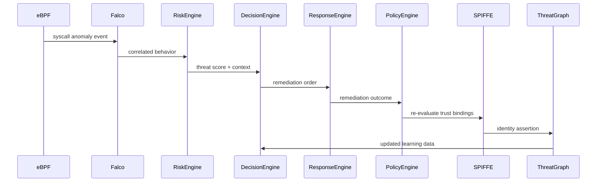

# SARTA — Sovereign Adaptive Resilience & Trust Architecture

**Executive Research & Production Security Blueprint (v3 Autonomous Mesh)**

**Version:** v3
**Format:** Mermaid Architecture Diagrams + SVG Assets
**Focus:** Autonomous Security • Sovereign Cloud • Zero Trust • AI Governance • Continuous Compliance

---

## Project Status

| Category                 | Status         |
| ------------------------ | -------------- |
| Architecture Design      | ✅ Complete     |
| Research Framework       | ✅ Complete     |
| Reference Blueprint      | ✅ Complete     |
| Prototype Implementation | 🚧 In Progress |
| Production Validation    | ⏳ Planned      |
| Community Contributions  | ✅ Open         |

**Current Release:** v3 Autonomous Mesh

---

## Abstract

SARTA (Sovereign Adaptive Resilience & Trust Architecture) is an applied-research and production-oriented security architecture that treats security, compliance, operational resilience, and digital sovereignty as a continuously operating autonomous system.

Rather than relying on static controls, periodic audits, or manually coordinated response workflows, SARTA integrates kernel-level sensing, identity-centric trust, AI-assisted decisioning, policy-as-code enforcement, and sovereign federation to create an adaptive security fabric capable of continuous monitoring, reasoning, response, and learning.

---

## Table of Contents

1. Executive Summary
2. Why SARTA Exists
3. Research Positioning
4. Core Research Thesis
5. Design Principles
6. System Architecture
7. Autonomous Security Loop
8. Technology Stack
9. Core Capabilities
10. Threat Model
11. Security Assumptions
12. AI Governance
13. Digital Immune System Model
14. Repository Structure
15. Compliance Alignment
16. Key Metrics
17. Example Attack Response Scenario
18. Architecture Decision Records
19. Reproducing the Demo
20. Contribution & Governance
21. Roadmap
22. Accessibility Notes
23. Style Guide
24. References
25. Citation
26. License

---

# Executive Summary

SARTA operationalizes:

* AI-assisted security governance
* Runtime Zero Trust enforcement
* Sovereign multi-cloud control planes
* Autonomous threat response
* Policy-as-code enforcement
* Continuous compliance engineering
* Federated threat intelligence
* Identity-centric trust verification

Key enabling technologies include:

* Kubernetes
* eBPF
* Falco
* SPIFFE / SPIRE
* OPA / Gatekeeper
* OpenTelemetry
* Federated threat intelligence graphs

---

# Why SARTA Exists

Modern enterprise security is fragmented across:

* SIEM platforms
* Runtime security tools
* Identity systems
* Compliance platforms
* Cloud governance frameworks
* Incident response processes

This fragmentation produces:

* Delayed detection
* Slow remediation
* Manual compliance evidence collection
* Policy drift
* Inconsistent trust enforcement

SARTA proposes a unified autonomous architecture capable of continuously detecting, reasoning about, and responding to security events while simultaneously generating compliance evidence and enforcing sovereign governance controls.

---

# Research Positioning

SARTA intersects several domains:

* Sovereign Cloud Computing
* Distributed Systems Security
* AI Governance Systems
* Operational Resilience Engineering
* Zero Trust Architecture
* Continuous Compliance Automation
* Federated Trust Systems

---

# Core Research Thesis

Security systems should evolve from static rule engines into autonomous digital immune systems capable of:

* Continuous sensing
* Contextual reasoning
* Autonomous response
* Policy adaptation
* Federated learning
* Self-healing behavior

Security becomes a computational process rather than a collection of disconnected controls.

---

# Design Principles

1. Identity Before Network Trust
2. Runtime Visibility Before Assumption
3. Policy as Executable Code
4. Autonomous Response by Default
5. Human Oversight Always Available
6. Sovereignty Preserved Across Domains
7. Continuous Verification Over Periodic Audit
8. Compliance as a Runtime Property

---

# System Architecture (v3 Autonomous Mesh)

```mermaid
flowchart TB
  subgraph L0 🌍 Runtime Layer
    A[Kubernetes Workloads]
    B[eBPF Kernel Sensors]
    C[Falco Detection Engine]
  end

  subgraph L1 🧠 Decision Layer
    D[Risk Scoring Engine]
    E[Attack Classification AI]
    F[Policy Reasoning Engine]
  end

  subgraph L2 ⚡ Autonomous Response Layer
    G[Isolation Controller]
    H[Pod Remediation Engine]
    I[Node Kill Switch]
  end

  subgraph L3 🛡 Policy Layer
    J[OPA / Gatekeeper]
    K[Dynamic Policy Mutation]
  end

  subgraph L4 🔐 Identity Layer
    L[SPIFFE / SPIRE Workload Identity]
  end

  subgraph L5 🌐 Sovereign Federation Layer
    M[Global Threat Graph]
    N[Cross-Cluster Event Bus]
  end

  L0 --> L1
  L1 --> L2
  L2 --> L3
  L3 --> L0
  L4 --> L1
  L5 --> L1
```

**Figure:** Runtime sensing feeds the decision layer, which drives autonomous responses and policy mutation. Identity and sovereign federation provide trust and telemetry.

---

# Autonomous Security Loop



**Security Lifecycle**

Detect → Correlate → Score → Decide → Remediate → Learn → Adapt

---

# Technology Stack

| Layer         | Technologies                             |
| ------------- | ---------------------------------------- |
| Runtime       | Kubernetes, eBPF, Falco                  |
| Identity      | SPIFFE, SPIRE                            |
| Policy        | OPA, Gatekeeper                          |
| Federation    | Multi-Cluster Event Bus                  |
| Observability | OpenTelemetry, Prometheus                |
| Analytics     | Risk Engine                              |
| AI Layer      | Attack Classification & Policy Reasoning |
| Compliance    | Continuous Control Validation            |

---

# Core Capabilities

## Runtime Security

* Kernel-level telemetry
* Behavioral anomaly detection
* Workload activity monitoring
* Container escape detection

## Zero Trust Enforcement

* Workload identity verification
* Mutual TLS enforcement
* Continuous trust validation
* Microsegmentation policies

## Autonomous Response

* Namespace isolation
* Pod termination
* Traffic throttling
* Node cordoning
* Policy mutation

## Sovereign Federation

* Cross-cluster intelligence sharing
* Regional governance controls
* Data locality enforcement
* Distributed trust propagation

## Continuous Compliance

* Automated evidence generation
* Control validation
* Policy compliance monitoring
* Audit trail creation

---

# Threat Model

## Protected Against

* Container escape attempts
* Privilege escalation
* Lateral movement
* Credential theft
* Policy drift
* Insider misuse
* Supply-chain compromise
* Unauthorized workload deployment

## Partially Addressed

* Advanced persistent threats
* Multi-stage intrusion campaigns
* Federated trust abuse

## Out of Scope

* Physical infrastructure compromise
* Hardware implants
* Nation-state firmware attacks
* Air-gapped operational environments

---

# Security Assumptions

SARTA assumes:

* Trusted Kubernetes control plane
* Protected workload identity roots
* Operational eBPF instrumentation
* Secure policy distribution channels
* Trusted federation members

Compromise of these assumptions requires additional compensating controls.

---

# AI Governance

AI systems within SARTA may:

* Generate risk scores
* Classify attack behavior
* Recommend remediation actions
* Suggest policy modifications

AI systems may not:

* Override root trust authorities
* Disable security controls
* Bypass policy validation
* Alter identity infrastructure without approval

All AI-generated actions are subject to policy-engine validation.

---

# Digital Immune System Model

| Biological System | SARTA Equivalent |
| ----------------- | ---------------- |
| White Blood Cells | Falco Sensors    |
| Brain             | Risk Engine      |
| Antibodies        | Policies         |
| Reflex System     | Response Engine  |
| Memory            | Threat Graph     |

---

# Repository Structure

```text
sarta/
├── control-plane/
├── runtime-security/
├── identity-layer/
├── policy-engine/
├── autonomy-engine/
├── threat-graph/
├── observability/
├── federation/
├── docs/
│   └── adr/
└── tests/
```

Each subsystem should contain:

```text
README.md
diagrams/
manifests/
tests/
```

---

# Compliance Alignment

| Framework  | Alignment                          |
| ---------- | ---------------------------------- |
| DORA       | Operational resilience controls    |
| NIS2       | Incident management and resilience |
| GDPR       | Data locality and auditability     |
| ISO 27001  | Runtime control enforcement        |
| PCI DSS    | Continuous policy validation       |
| Zero Trust | Continuous verification            |

---

# Key Metrics

* Mean Time To Detect (MTTD)
* Mean Time To Respond (MTTR)
* False Positive Rate
* Compliance Coverage
* Policy Drift Rate
* Federation Latency
* Identity Verification Success Rate

---

# Example Attack Response Scenario

1. Malicious workload executes unauthorized shell.
2. eBPF captures syscall anomaly.
3. Falco correlates suspicious activity.
4. Risk Engine generates threat score.
5. Decision Engine classifies attack pattern.
6. Response Engine isolates namespace.
7. SPIFFE trust bindings are reevaluated.
8. Threat Graph propagates intelligence.
9. Updated policies are distributed globally.

---

# Architecture Decision Records

Architecture decisions are maintained in:

```text
docs/adr/
```

Each ADR documents:

* Context
* Decision
* Alternatives
* Consequences

---

# Reproducing the Demo

Prerequisites:

* Kubernetes v1.25+
* OPA Gatekeeper
* SPIRE
* Falco
* Linux Kernel 5.x+
* eBPF support

Deployment:

```bash
kubectl apply -f control-plane/manifests/
kubectl apply -f identity-layer/manifests/

helm install falco runtime-security/helm/falco

kubectl apply -f autonomy-engine/manifests/

make demo-run
```

Demo harness:

```text
autonomy-engine/demo/
observability/e2e/
```

---

# Contribution & Governance

* CLA or DCO required
* Trunk-based development
* Policy-change review gates
* Security-first code review
* Severity-based issue triage
* Monthly security releases
* Quarterly architecture reviews

---

# Roadmap

## v3

* Autonomous response workflows
* Federated threat intelligence
* Dynamic policy mutation

## v4

* Adaptive policy optimization
* Multi-region sovereignty controls
* Advanced risk reasoning

## v5

* Autonomous compliance attestation
* Cross-domain federation
* Self-healing infrastructure orchestration

---

# Accessibility & Publication Notes

* Mermaid source maintained alongside SVG exports
* Accessible color palette
* Contrast ratio ≥ 4.5:1
* Alt text for all diagrams
* PDF export support

Recommended publication flow:

```text
README → HTML → PDF
```

---

# Style Guide

## Palette

Primary Teal: #0F766E

Accent Indigo: #3730A3

Alert Coral: #F97316

Neutral Slate: #334155

---

# References

* NIST SP 800-207 Zero Trust Architecture
* SPIFFE Specification
* SPIRE Documentation
* Falco Runtime Security Documentation
* Open Policy Agent Documentation
* DORA Regulation
* NIS2 Directive
* ISO 27001
* GDPR

---

# Citation

```bibtex
@misc{sarta2026,
  title={Sovereign Adaptive Resilience and Trust Architecture (SARTA)},
  year={2026},
  version={v3}
}
```

---

# License

Licensed under Apache License 2.0.

See LICENSE for details.


*   **Principal Investigator:** Mr. Mehlek Dawveed, MSc.
*   **Contact Email:** [mehlekd@gmail.com](mailto:mehlekd@gmail.com)
*   **Professional Matrix:** [LinkedIn Portfolio](https://linkedin.com)
*   **Current Alignment Focus:** Open to Collaborative Research Programs, Funded PhD Positions, and EU Horizon Europe / NATO SPS Project Integration within the UK, Ireland, Netherlands, and wider EU ecosystems.
