# SARTA™🛡️ Sovereign Adaptive Resilience & Trust Architecture

> **A Reference Security Architecture for Autonomous Security, Digital Sovereignty, and Continuous Compliance that explores how security, trust, compliance, operational resilience, and digital sovereignty can be implemented as continuously adaptive computational systems**.

**SARTA™ reframes cybersecurity from a static control problem into a living autonomous system capable of sensing, reasoning, and responding in real time.**


---

## AI-SABOK™ AI Security Architect Body of Knowledge
Mission Statement
To establish the definitive, vendor-neutral body of knowledge for AI Security Architects by integrating enterprise architecture, cybersecurity, identity, governance, cloud platforms, AI engineering concepts, and operational best practices into a single, practical reference.

---

## AITORA™ AI Trust & Operational Readiness Assessment
The Market Position
AITORA™ provides enterprises with a comprehensive, framework-aligned assessment to determine whether AI systems are secure, governed, resilient, and operationally ready for trusted deployment.

---

**👤 Created by Mr. Mehlek Dawveed, Chief Security Architect**

**Copyright © June 1, 2026 by Mr. Mehlek Dawveed (SARTA™ / AI-SABOK™ / AITORA™) All Rights Reserved**

---
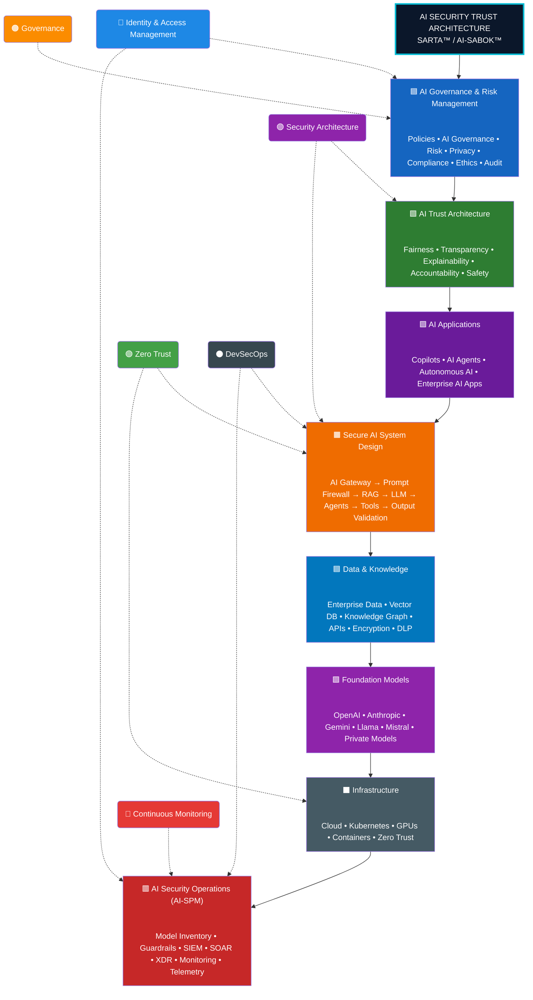
## Design Principles

The architecture is built on six core principles:

1. **Secure by Design**
2. **Trust by Default**
3. **Zero Trust Everywhere**
4. **Govern Throughout the AI Lifecycle**
5. **Monitor Continuously**
6. **Improve Through Measured Risk**

---
## Framework Overview

**SARTA™ (Security Architecture, Risk, Trust & Assurance)** is an enterprise AI security framework that integrates governance, trust, cybersecurity, privacy, identity, and operational resilience into a unified architecture for AI systems.

**AI-SABOK™ (AI Security Architecture Body of Knowledge)** defines the core domains, principles, and best practices required to design, build, secure, deploy, monitor, and govern trustworthy AI solutions throughout their lifecycle.

Together, these frameworks provide a structured approach for implementing:

* 🛡️ AI Governance & Risk Management (aligned with the NIST AI RMF)
* 🤝 AI Trust Architecture
* 🏗️ Secure AI System Design (RAG, Agents, AI Gateways)
* 🔍 AI Threat Modeling & Risk Analysis
* 🔐 AI Identity & Access Management
* 📊 AI Security Posture Management (AI-SPM)
* 🚀 Continuous Monitoring & Operational Resilience

---

## Architecture Layers

| Layer                                  | Purpose                                                                              |
| -------------------------------------- | ------------------------------------------------------------------------------------ |
| 🟦 **Governance & Risk Management**    | Policies, compliance, ethics, privacy, and enterprise AI governance                  |
| 🟩 **AI Trust Architecture**           | Fairness, transparency, explainability, accountability, safety, and resilience       |
| 🟪 **AI Applications**                 | Copilots, AI assistants, autonomous AI, and enterprise AI applications               |
| 🟧 **Secure AI System Design**         | AI Gateways, Prompt Firewalls, RAG, Agents, MCP, and output validation               |
| 🟦 **Data & Knowledge**                | Enterprise data, vector databases, knowledge graphs, APIs, encryption, and DLP       |
| 🟪 **Foundation Models**               | Public and private LLMs, foundation models, and fine-tuned models                    |
| ⬛ **Infrastructure**                   | Cloud, Kubernetes, GPUs, containers, networking, and Zero Trust                      |
| 🟥 **AI Security Operations (AI-SPM)** | Guardrails, monitoring, telemetry, SIEM, SOAR, XDR, posture management, and auditing |

---

## Cross-Cutting Security Pillars

These capabilities apply across **every layer** of the architecture:

* 🔵 **Identity & Access Management**
* 🟢 **Zero Trust**
* 🟣 **Security Architecture**
* 🟠 **Governance**
* 🔴 **Continuous Monitoring**
* ⚫ **DevSecOps**

---

## 🎯 Core Objectives

* 🧠 Advance research into autonomous security systems
* ☁️ Define sovereign Zero Trust cloud architectures
* 🔐 Model compliance as a continuous computational process
* 🤖 Explore AI-assisted security governance
* 🧩 Demonstrate systems architecture & security engineering at research level

---

### Research Domains

* Autonomous Security Systems
* Zero Trust Architecture (Zero Trust Security)
* AI Governance
* Digital Sovereignty
* Cloud Security Engineering
* Distributed Trust Systems
* Continuous Compliance Automation
* Operational Resilience Engineering

---


## 🚦 Project Status

| Area                   | Status         |
| ---------------------- | -------------- |
| Research Framework     | ✅ Complete     |
| Reference Architecture | ✅ Complete     |
| Threat Model           | ✅ Defined      |
| Governance Model       | ✅ Defined      |
| Prototype Systems      | 🚧 In Progress |
| Production Validation  | ⏳ Future Work  |
| Academic Publication   | ⏳ Planned      |

---

## 🧠 Core Idea: Autonomous Security Mesh (v3)

SARTA introduces a shift from fragmented tooling to a unified **Autonomous Security Mesh**:

### 🔄 Continuous Security Loop

```mermaid
flowchart LR

%% =========================
%% CORE LOOP
%% =========================

A[Runtime Telemetry<br/>Kernel + Workload Signals] --> 
B[Risk Engine<br/>Behavioral + Threat Scoring]

B --> 
C[Policy Decision Layer<br/>Policy-as-Code Evaluation]

C --> 
D[Autonomous Response Engine<br/>Mitigation & Containment]

D --> 
E[Identity & Trust Re-evaluation<br/>Continuous Verification]

E --> 
F[Federated Intelligence Sharing<br/>Cross-Domain Threat Learning]

F --> 
B

%% =========================
%% VISUAL STYLING
%% =========================

classDef telemetry fill:#1e88e5,color:#ffffff,stroke:#90caf9,stroke-width:1px;
classDef risk fill:#6a1b9a,color:#ffffff,stroke:#ce93d8,stroke-width:1px;
classDef policy fill:#2e7d32,color:#ffffff,stroke:#a5d6a7,stroke-width:1px;
classDef response fill:#d32f2f,color:#ffffff,stroke:#ef9a9a,stroke-width:1px;
classDef identity fill:#00897b,color:#ffffff,stroke:#80cbc4,stroke-width:1px;
classDef federation fill:#1565c0,color:#ffffff,stroke:#64b5f6,stroke-width:1px;

class A telemetry;
class B risk;
class C policy;
class D response;
class E identity;
class F federation;

%% =========================
%% FLOW EMPHASIS
%% =========================

linkStyle default stroke:#90a4ae,stroke-width:2px;
```

---

## ⚙️ Key Capabilities

### 👁️ Runtime Intelligence

* Kernel-level telemetry
* Behavioral anomaly detection
* Container activity monitoring
* Live attack surface mapping

### 🧠 1. Runtime Intelligence Layer (Sensing & Perception)

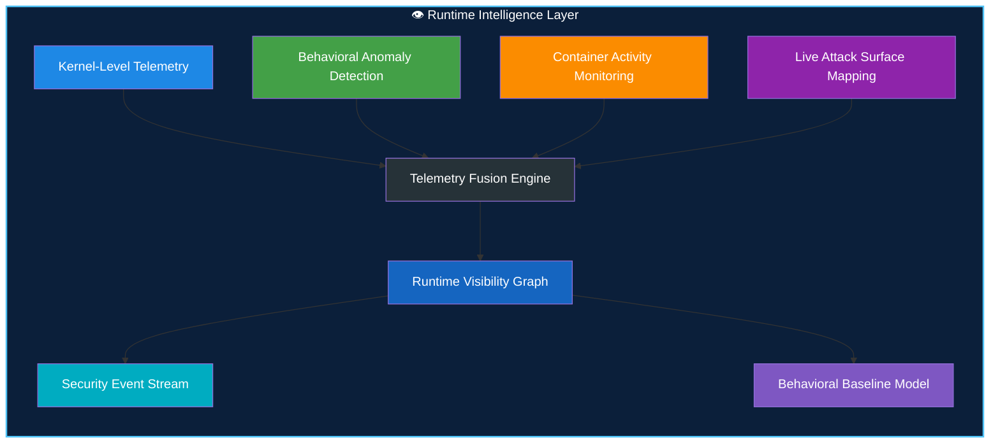

---

### 🔐 Zero Trust Enforcement

* Continuous workload identity validation
* Mutual authentication
* Policy-driven authorization
* Real-time trust scoring

### 🛡️ 2. Zero Trust Enforcement Layer (Continuous Verification)

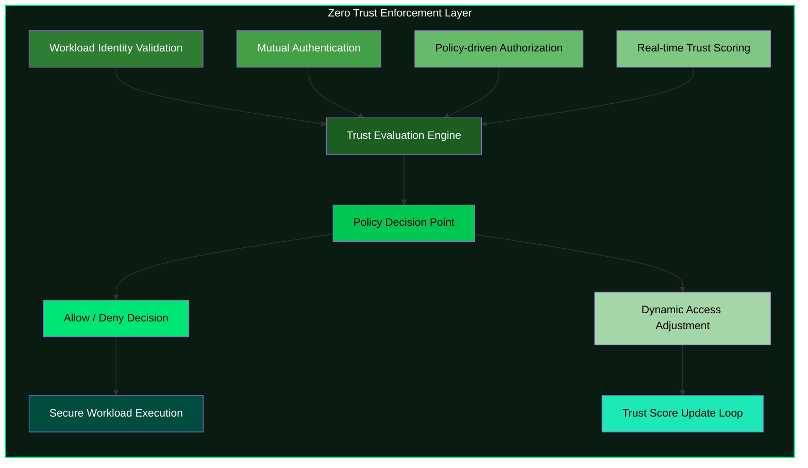

---

### ⚡ Autonomous Response

* Namespace isolation
* Pod termination
* Traffic throttling
* Node quarantine
* Dynamic policy updates

### ⚡ 3. Autonomous Response System (Digital Reflex Layer)

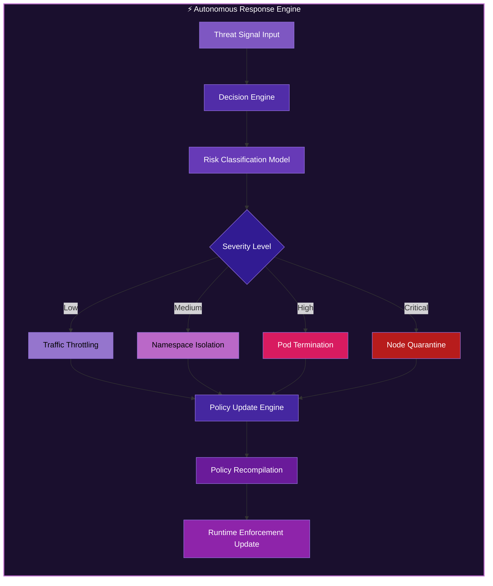

---

### 🌍 Sovereign Federation

* Cross-domain intelligence sharing
* Regional policy autonomy
* Data locality enforcement
* Federated trust propagation

### 🌍 4. Sovereign Federation Layer (Distributed Trust System)

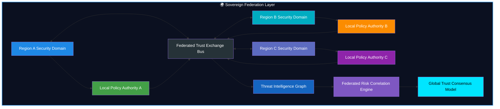

---

## 🧬 Executive Summary

SARTA operationalizes:

* AI-assisted security governance
* Runtime Zero Trust enforcement
* Sovereign multi-cloud control planes
* Federated threat intelligence
* Autonomous incident response
* Policy-as-code enforcement
* Continuous compliance verification
* Digital sovereignty controls

---

### ✨ Master Architecture View (All Layers Combined)

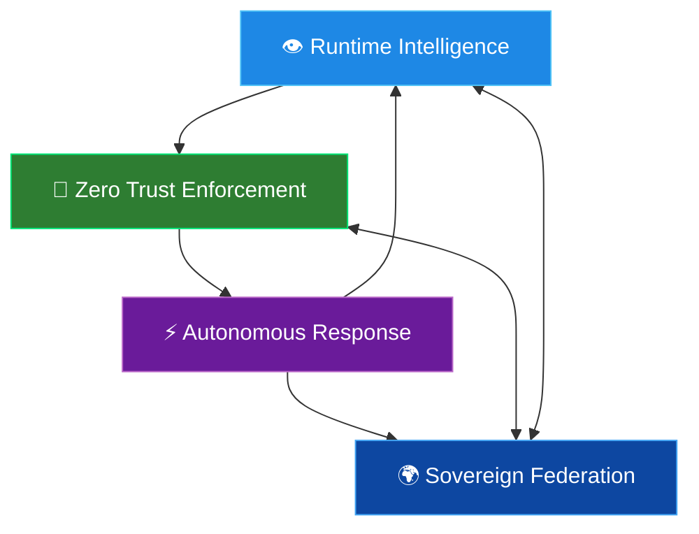

---

## ❓ Why SARTA Exists

Modern security ecosystems are fragmented across:

* SIEM systems
* Identity providers
* Runtime security tools
* Compliance frameworks
* Incident response workflows

### ⚠️ Resulting Problems

* Delayed detection
* Slow response cycles
* Policy inconsistency
* High operational overhead
* Fragmented visibility

SARTA explores whether these can be unified into a **single adaptive computational system**.

---

## 🧪 Research Motivation

Modern infrastructure spans:

* Multi-cloud environments
* Sovereign jurisdictions
* Distributed trust boundaries

Traditional security models remain static and human-driven.

SARTA investigates:

> Can security become a **self-regulating computational organism**?

---

## 🔬 Research Questions

* Can Zero Trust adapt continuously using runtime learning?
* Can compliance become executable code instead of documentation?
* Can sovereign systems share intelligence without losing autonomy?
* What governance is required for AI-driven security decisions?
* Can resilience be continuously verified at runtime?

---

## 🧭 Core Thesis

Security systems should evolve into **digital immune systems**:

* Continuous sensing
* Context-aware reasoning
* Autonomous response
* Policy evolution
* Federated intelligence
* Self-healing behavior

---

## 🧱 Design Principles

* Identity before network trust
* Runtime visibility over assumptions
* Policy as executable logic
* Autonomous response by default
* Human oversight always available
* Sovereignty preserved across domains
* Continuous verification over audits
* Compliance as a runtime property

---

## 🏗️ System Architecture (v3 Autonomous Mesh)

### 🧩 Layered Model

* Identity Layer
* Policy Engine
* Runtime Security Layer
* Autonomy Engine
* Threat Graph
* Observability Layer
* Federation Layer

---

### 🧠 Technology Stack

<div align="center">


</div>

---

### 🏗️ Platform Architecture

| 🏢 Layer | 🚀 Technologies | 🎯 Purpose |
|----------|----------------|------------|
| ⚙️ Runtime | Kubernetes • eBPF • Falco | Secure cloud-native workload execution |
| 🔐 Identity | SPIFFE • SPIRE | Zero Trust workload identity |
| 📜 Policy | Open Policy Agent (OPA) • Gatekeeper | Policy-as-Code & governance |
| 📊 Observability | OpenTelemetry • Prometheus | Monitoring, telemetry & visibility |
| 🤖 Intelligence | AI Risk Scoring Engine | Threat prediction & risk analysis |
| 🛡️ Compliance | Continuous Verification System | Automated compliance assurance |

---

### 📐 Security Architecture

<div align="center">


</div>

---

### 🏗️ Layered Security Platform

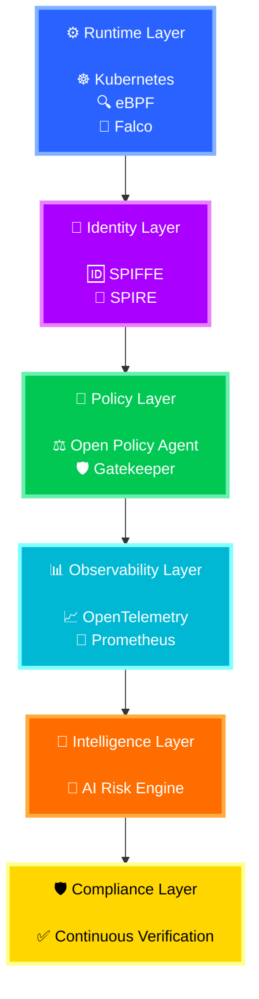

---

### 🌈 Capability Flow

```text
⚙️ Runtime Security
        │
        ▼
🔐 Zero Trust Identity
        │
        ▼
📜 Policy Enforcement
        │
        ▼
📊 Telemetry & Visibility
        │
        ▼
🤖 AI Risk Intelligence
        │
        ▼
🛡️ Continuous Compliance
```

---

### 🎯 Security Capability Matrix

| Layer            | Mission                   | Status    |
| ---------------- | ------------------------- | --------- |
| ⚙️ Runtime       | Workload Protection       | 🟢 Active |
| 🔐 Identity      | Zero Trust Authentication | 🟢 Active |
| 📜 Policy        | Governance & Enforcement  | 🟢 Active |
| 📊 Observability | Telemetry & Monitoring    | 🟢 Active |
| 🤖 Intelligence  | AI Risk Analysis          | 🟢 Active |
| 🛡️ Compliance   | Continuous Assurance      | 🟢 Active |

---

### 🚀 Security Operating Model


> [!IMPORTANT]
> This architecture implements a **Zero Trust, AI-Driven Digital Immune System** where every workload is authenticated, every action is authorized, every event is observed, every risk is analyzed, and every control is continuously verified for compliance.

---

### 🎯 Capability Mapping

| Capability | Status |
|------------|---------|
| 🔐 Zero Trust Identity | 🟢 Enabled |
| ☁️ Cloud Native Security | 🟢 Enabled |
| 📜 Policy as Code | 🟢 Enabled |
| 📊 Real-Time Monitoring | 🟢 Enabled |
| 🤖 AI-Powered Risk Analysis | 🟢 Enabled |
| 🛡️ Continuous Compliance | 🟢 Enabled |
| 🚨 Threat Detection | 🟢 Enabled |
| 🔍 Audit Readiness | 🟢 Enabled |

---

> [!TIP]
> This architecture combines **Zero Trust**, **Cloud Native Security**, **Policy-as-Code**, **Observability**, **AI-Driven Risk Analytics**, and **Continuous Compliance** into a unified security platform.

## 🧪 Threat Model

### ✅ Defended Against

* Privilege escalation
* Credential misuse
* Lateral movement
* Supply chain compromise
* Policy drift
* Insider threats

### ⚠️ Partially Addressed

* Advanced persistent threats
* Multi-stage intrusion campaigns
* Federated trust abuse

### 🚫 Out of Scope

* Hardware implants
* Firmware-level attacks
* Physical infrastructure compromise

---

## 🤖 AI Governance Model

### Allowed Actions

* Risk scoring
* Threat classification
* Remediation suggestions
* Policy recommendations

### Forbidden Actions

* Overriding trust roots
* Disabling security controls
* Bypassing policy enforcement
* Autonomous identity modification

> All AI actions remain **policy-bound and human-governed**.

---

## 🧬 Digital Immune System Model

<div align="center">


</div>

---

### 🌐 Biological-to-Digital Mapping

| 🧬 Biological System | 🛡️ SARTA Equivalent   | 🎯 Function                                      |
| -------------------- | ---------------------- | ------------------------------------------------ |
| ⚪ White Blood Cells  | Runtime Sensors        | Detect threats and anomalies in real time        |
| 🧠 Brain             | AI Risk Engine         | Analyze, correlate, and prioritize risks         |
| 🧪 Antibodies        | Policy System          | Prevent and neutralize malicious actions         |
| ⚡ Reflex System      | Response Engine        | Execute automated containment and remediation    |
| 🧠💾 Immune Memory   | Threat Knowledge Graph | Learn from previous attacks and improve defenses |

---

### 🧬 Digital Immune Response Cycle

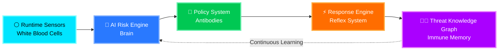

---

### 🩺 Immune System Health Indicators

| Capability               | Status    |
| ------------------------ | --------- |
| 🔍 Threat Detection      | 🟢 Active |
| 🧠 Risk Intelligence     | 🟢 Active |
| 🛡️ Policy Enforcement   | 🟢 Active |
| ⚡ Automated Response     | 🟢 Active |
| 📚 Threat Learning       | 🟢 Active |
| 🔄 Continuous Adaptation | 🟢 Active |

---

## 🎨 Defense Maturity Overview

```text
⚪ Runtime Sensors          🟢🟢🟢🟢🟢 🟢🟢🟢🟢🟢
🧠 AI Risk Engine          🟢🟢🟢🟢🟢 🟢🟢🟢🟢🟢
🧪 Policy System           🟢🟢🟢🟢🟢 🟢🟢🟢🟢🟢
⚡ Response Engine         🟢🟢🟢🟢🟢 🟢🟢🟢🟢⚪
🧠💾 Threat Knowledge      🟢🟢🟢🟢🟢 🟢🟢🟢🟢🟢
```

---

> [!TIP]
> Just as the human immune system continuously detects, analyzes, responds, and learns from biological threats, the **SARTA Digital Immune System** continuously monitors workloads, evaluates risk, enforces policy, orchestrates automated responses, and builds institutional memory from every security event.

## 🚀 Autonomous Cyber Defense Architecture

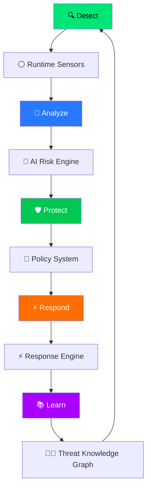

---

## 📁 Repository Structure

```bash
sarta/
├── README.md
├── LICENSE
├── SECURITY.md
├── CONTRIBUTING.md
├── ROADMAP.md
│
├── docs/
│   ├── architecture.md
│   ├── threat-model.md
│   ├── compliance-mapping.md
│   ├── research-roadmap.md
│   ├── publications/
│   ├── diagrams/
│   └── adr/
│
├── control-plane/
├── runtime-security/
├── identity-layer/
├── policy-engine/
├── autonomy-engine/
├── threat-graph/
├── federation/
├── observability/
└── tests/
```

---

<div align="center">

## 🌐 Global Cybersecurity Framework Alignment Matrix


### 🛡️ Global Crosswalk of Cybersecurity, Privacy, Resilience, and Compliance Frameworks

</div>

---

## 📌 Alignment Legend

| Rating | Meaning |
|----------|----------|
| 🟣 Very High | Directly aligned |
| 🟢 High | Strong alignment |
| 🟡 Medium | Partial alignment |
| 🔴 Low | Limited alignment |

---

## 🇺🇸 United States

---

## 🔵 NIST Cybersecurity Framework (CSF) 2.0


### Alignment Matrix

| Standard | Alignment |
|-----------|------------|
| NIST SP 800-207 | 🟢 High |
| ISO 27001 | 🟢 High |
| GDPR | 🟡 Medium |
| DORA | 🟢 High |
| NIS2 | 🟢 High |
| PCI DSS | 🟡 Medium |

### Key Areas

- 🏛️ Governance
- 🎯 Risk Management
- 🔐 Identity & Access Management
- 🚨 Incident Response
- 🔗 Supply Chain Security
- 📈 Continuous Monitoring

---

## 🔷 NIST SP 800-53 Rev.5

> [!TIP]
> Considered one of the most comprehensive security control catalogs globally.

### Alignment Matrix

| Standard | Alignment |
|-----------|------------|
| NIST SP 800-207 | 🟢 High |
| ISO 27001 | 🟢 High |
| GDPR | 🟢 High |
| DORA | 🟢 High |
| NIS2 | 🟢 High |
| PCI DSS | 🟢 High |

### Key Areas

- 🔒 Access Control
- 📝 Audit Logging
- 🔑 Encryption
- 👤 Privacy Controls
- ♻️ Resilience & Recovery
- 📡 Security Monitoring

---

## 🟦 CISA Zero Trust Maturity Model

### Alignment Matrix

| Standard | Alignment |
|-----------|------------|
| NIST SP 800-207 | 🟣 Very High |
| ISO 27001 | 🟡 Medium |
| GDPR | 🔴 Low |
| DORA | 🟡 Medium |
| NIS2 | 🟡 Medium |
| PCI DSS | 🔴 Low |

### Domains

- 👤 Identity
- 💻 Devices
- 🌐 Networks
- 📦 Applications
- 📁 Data
- 📊 Analytics
- 🤖 Automation

---

## ☁️ FedRAMP

### Focus

- ☁️ Cloud Security
- 📈 Continuous Monitoring
- 🏛️ Authorization Management
- 🎯 Risk Assessment

---

## 🇨🇦 Canada

<details>
<summary><b>🟥 ITSG-33</b></summary>

### Alignment Matrix

| Standard | Alignment |
|-----------|------------|
| NIST SP 800-207 | 🟢 High |
| ISO 27001 | 🟢 High |
| GDPR | 🟡 Medium |
| DORA | 🟡 Medium |
| NIS2 | 🟡 Medium |
| PCI DSS | 🟡 Medium |

### Focus Areas

- 🔐 Security Controls
- 🎯 Risk Management
- 🔄 Continuous Authorization
- 🏛️ Government Baselines

</details>

<details>
<summary><b>🟥 Protected B Cloud Profile</b></summary>

### Focus Areas

- ☁️ Cloud Security
- 🏛️ Government Workloads
- 📂 Data Classification
- 🔐 Secure Operations

</details>

<details>
<summary><b>🟥 PIPEDA</b></summary>

### Focus Areas

- 👤 Privacy Management
- 🔒 Data Protection
- ✅ Consent Management
- 🚨 Breach Notification

</details>

---

## 🇪🇺 European Union

## 🟦 EUCS


### Focus Areas

- ☁️ Cloud Assurance
- 🏆 Security Certification
- 🎯 Risk Management

---

## 🟨 eIDAS 2.0

### Focus Areas

- 🆔 Digital Identity
- 🔑 Strong Authentication
- 🤝 Trust Services

---

## 🟪 EBA ICT Guidelines

> [!IMPORTANT]
> One of the strongest operational resilience frameworks influencing DORA implementation.

### Focus Areas

- 📡 ICT Risk Management
- 🔗 Outsourcing Risk
- ♻️ Operational Resilience

---

## 🟦 ENISA Cybersecurity Guidance

### Strengths

| Area | Rating |
|--------|---------|
| NIS2 | 🟣 Very High |
| DORA | 🟢 High |
| ISO 27001 | 🟢 High |

---

## 🇬🇧 United Kingdom

## 🔷 NCSC Cyber Assessment Framework (CAF)

### Security Outcomes

- 🎯 Risk Management
- 🛡️ Asset Protection
- 🔎 Detection
- 🚨 Response
- ♻️ Recovery

---

## 🟢 Cyber Essentials Plus

### Core Controls

- 🔑 Multi-Factor Authentication
- 🔄 Patch Management
- ⚙️ Secure Configuration
- 🦠 Malware Protection

---

## 🔵 UK GDPR

### Primary Focus

- 👤 Data Privacy
- 🔒 Personal Data Protection
- 📜 Regulatory Compliance

---

## 🌍 Middle East

## 🇦🇪 United Arab Emirates

### 🌟 UAE Information Assurance Standards (IAS)

<div align="center">


</div>

| Security Domain         | Maturity              |
| ----------------------- | --------------------- |
| 🟦 Security Governance  | 🟢🟢🟢🟢🟢 🟢🟢🟢🟢🟢 |
| 🟪 Risk Management      | 🟢🟢🟢🟢🟢 🟢🟢🟢🟢🟢 |
| 🟨 Compliance           | 🟢🟢🟢🟢🟢 🟢🟢🟢🟢⚪  |
| 🟥 Operational Security | 🟢🟢🟢🟢🟢 🟢🟢🟢🟢🟢 |

---

### UAE PDPL

- 👤 Privacy Protection
- 🔐 Data Governance
- 🌐 Cross-Border Data Controls

---

## 🇸🇦 Saudi Arabia

### Essential Cybersecurity Controls (ECC)


Key Areas:

- 🔐 Cybersecurity Governance
- 🎯 Risk Management
- 🏢 Organizational Security
- 📡 Operational Security

---

### Cloud Cybersecurity Controls (CCC)

- ☁️ Cloud Security
- 🔒 Data Protection
- 🔑 Identity Management
- 🛡️ Zero Trust Principles

---

## 🌏 Asia-Pacific

## 🇸🇬 Singapore

### Critical Information Infrastructure Code

| Domain | Rating |
|----------|----------|
| DORA Alignment | 🟢 High |
| NIS2 Alignment | 🟢 High |
| ISO 27001 Alignment | 🟢 High |

---

## 🇯🇵 Japan

### Cybersecurity Management Guidelines

- 🏛️ Governance
- 🎯 Risk Management
- 🔐 Security Controls
- 📈 Continuous Improvement

---

## 🇦🇺 Australia

### 🚀 Essential Eight

<div align="center">


</div>

| Security Control                | Maturity              |
| ------------------------------- | --------------------- |
| 🟦 Application Control          | 🟢🟢🟢🟢🟢 🟢🟢🟢🟢🟢 |
| 🟪 Patch Applications           | 🟢🟢🟢🟢🟢 🟢🟢🟢🟢🟢 |
| 🟨 Multi-Factor Authentication  | 🟢🟢🟢🟢🟢 🟢🟢🟢🟢🟢 |
| 🟥 Privileged Access Management | 🟢🟢🟢🟢🟢 🟢🟢🟢🟢⚪  |
| 🟩 Backup & Recovery            | 🟢🟢🟢🟢🟢 🟢🟢🟢🟢🟢 |

---

## 📊 Global Alignment Summary

| Framework | Zero Trust | ISO 27001 | GDPR | DORA | NIS2 | PCI DSS |
|------------|------------|------------|------------|------------|------------|------------|
| NIST CSF 2.0 | 🟢 | 🟢 | 🟡 | 🟢 | 🟢 | 🟡 |
| NIST SP 800-53 | 🟢 | 🟢 | 🟢 | 🟢 | 🟢 | 🟢 |
| CISA ZTMM | 🟣 | 🟡 | 🔴 | 🟡 | 🟡 | 🔴 |
| ITSG-33 | 🟢 | 🟢 | 🟡 | 🟡 | 🟡 | 🟡 |
| UK CAF | 🟡 | 🟢 | 🟡 | 🟢 | 🟢 | 🟡 |
| Saudi ECC | 🟢 | 🟢 | 🟡 | 🟡 | 🟡 | 🟡 |
| UAE IAS | 🟡 | 🟢 | 🟡 | 🟡 | 🟡 | 🟡 |
| Singapore CII | 🟡 | 🟢 | 🟡 | 🟢 | 🟢 | 🔴 |
| ACSC ISM | 🟢 | 🟢 | 🟡 | 🟡 | 🟡 | 🟡 |
| PCI DSS 4.0 | 🟡 | 🟢 | 🟡 | 🟡 | 🟡 | 🟣 |

---

## 🚀 Recommended Global Baseline Stack

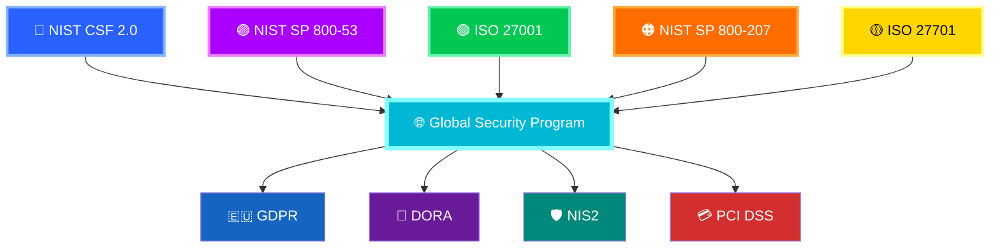

> [!SUCCESS]
> 🛡️ **Global Security Program Foundation**
>
> 🔵 NIST CSF 2.0
> 🟣 NIST SP 800-53
> 🟢 ISO 27001
> 🟡 ISO 27701
> 🟠 NIST SP 800-207 (Zero Trust)
>
> Together, these frameworks provide comprehensive coverage for:
>
> * 🇪🇺 GDPR
> * 🏦 DORA
> * 🛡️ NIS2
> * 💳 PCI DSS 4.0
> * ☁️ Cloud Security
> * 🔐 Zero Trust Architecture
> * 🌍 Global Regulatory Compliance

## 📈 Key Metrics

* Mean Time to Detect (MTTD)
* Mean Time to Respond (MTTR)
* Policy Drift Rate
* False Positive Rate
* Compliance Coverage
* Federation Latency
* Identity Verification Success Rate

---

## ⚔️ Example Attack Response Flow

```text
1. Malicious workload executes
2. Runtime telemetry detects anomaly
3. Risk engine evaluates behavior
4. Policy engine classifies threat
5. Response engine isolates workload
6. Identity trust is recalculated
7. Federation shares intelligence
8. Policies are updated automatically
```

---

## 🧭 Architecture Decision Records (ADR)

Stored in:

```bash
docs/adr/
```

Each ADR documents:

* Context
* Decision
* Alternatives
* Consequences

---

## 🔬 Research Contributions

* Autonomous Security Control Model
* Federated Sovereign Trust Framework
* Continuous Compliance Architecture
* AI Governance for Security Operations
* Digital Immune System Paradigm

---

## 🗺️ Research Roadmap

* Phase 1 — Reference Architecture
* Phase 2 — Prototype Validation
* Phase 3 — Adaptive Policy Systems
* Phase 4 — Sovereign Federation Experiments
* Phase 5 — AI Governance Validation
* Phase 6 — Large-Scale Operational Testing

---

## 🚀 Reproducing the System

### Requirements

* Kubernetes v1.25+
* Linux kernel 5.x+ with eBPF support
* Open Policy Agent
* Falco
* SPIRE

### Deployment

```bash
kubectl apply -f control-plane/manifests/
kubectl apply -f identity-layer/manifests/
helm install falco runtime-security/helm/falco
kubectl apply -f autonomy-engine/manifests/
make demo-run
```

---

## 🤝 Contribution & Governance

* Trunk-based development
* Security-first review process
* Policy change approval workflow
* Architecture review gates
* Severity-based issue triage

---

## 📚 Publications

All research papers and drafts:

```bash
docs/publications/
```

---

## 🧾 Citation

```bibtex
@misc{sarta2026,
  title={Sovereign Adaptive Resilience and Trust Architecture},
  author={Mr. Mehlek Dawveed},
  year={2026},
  version={v3}
}
```

## SARTA™ v3 — Sovereign Adaptive Resilience & Trust Architecture

* ☁️ Sovereign Cloud Workloads
* ⚪ Runtime Intelligence
* 🔐 Zero Trust Identity
* 📜 Policy-as-Code Governance
* 📊 Observability & Threat Graph
* 🧠 AI Risk Intelligence
* ⚡ Autonomous Response
* 🛡️ Continuous Compliance
* 🌍 Sovereign Federation
* 👨‍⚖️ Human Governance

### Detect → Verify → Govern → Observe → Analyze → Respond → Comply → Federate → Learn → Adapt
---


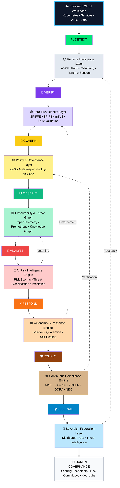

---

## 📜 License

Licensed under the **Apache License 2.0**

---

## Dawveed, M. (2026) Sovereign Adaptive Resilience & Trust Architecture (SARTA)


