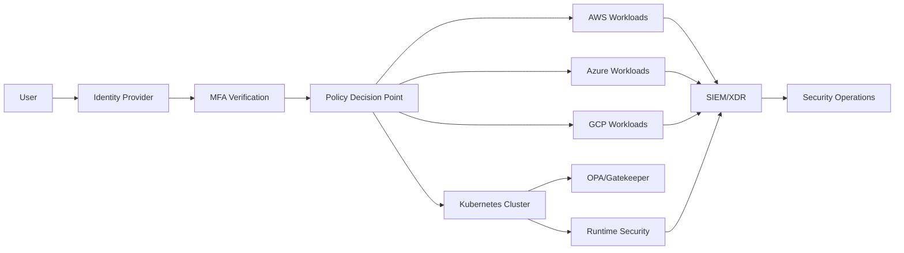
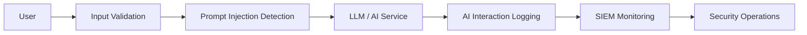

# Applied Research & Architecture Lab

This repository represents an applied cyber resilience and sovereign cloud security research initiative focused on:
- Sovereign Cloud Security Architecture
- Operational Resilience Engineering
- Zero Trust Enterprise Security Models
- AI Security Governance Frameworks
- Kubernetes Security and Policy-As-Code Enforcement
- Cloud-Native Detection Engineering
- Identity-Centric Security Architectures

The objective is to bridge enterprise security architecture practice with applied research in regulated and sovereign digital infrastructure environments.

## Author, Mr. Mehlek Dawveed
Principal Sovereign Cloud Security & Operational Resilience Architect

## SARTA – Sovereign Adaptive Resilience & Trust Architecture Lab

Our lab is based on Zero Trust Architecture, Kubernetes security, AI governance, and policy-as-code controls, aligned with global governance, regulatory, compliance, risk, privacy, and operational resilience requirements to counter emerging threats. The project integrates cloud-native security engineering, identity-centric governance, detection engineering, and resilience-by-design principles across multi-cloud and Kubernetes environments.

### SARTA is aligned with the following:
- DORA (Digital Operational Resilience Act)
- NIS2 Directive
- GDPR
- ISO 27001
- EU AI Act
- NIST SP 800-207 (Zero Trust)
- Secure AI Workload Governance
- IAM / PAM / Identity Federation
- Detection Engineering & SIEM Modernization
- Multi-Cloud Security Strategy (AWS / MS AZURE / GCP)
- Supply Chain Security (SLSA / SBOM / Sigstore)

### Security Domains:
#### Identity & Access Governance
- MFA (Full Enforcement) 
- Least Privilege IAM
- RBAC Enforcement
- Conditional Access
- Federated Identity Governance
- Workload Identity Architecture
#### Kubernetes Security
- Pod Security Standards
- Runtime Security Controls
- Network Policy Segmentation
- Admission Control Enforcement
- Supply Chain Protection
#### Cloud Security
- Encryption-By-Default
- Sovereign Region Restrictions
- Cloud-Native Segmentation
- Infrastructure-as-Code Governance
#### AI Security Governance
- Prompt Injection Mitigation
- AI Interaction Logging
- Secure AI Workload Segmentation
- Input Filtering and Validation
#### Detection Engineering
- Cloud-Native Telemetry
- SIEM Integration
- Threat Detection Logic
- MITRE ATT&CK Aligned Detections
________________________________________
#### Threat Scenarios
- Kubernetes Privilege Escalation
- CI/CD Pipeline Compromise
- Identity Federation Abuse
- Cloud Lateral Movement
- Prompt Injection Attacks
- Cross-Region Sovereignty Violations
_________________________________________
#### Technologies
AWS • Azure • GCP • Kubernetes • Terraform • OPA • Falco • Splunk • Sentinel
_________________________________________
  
### ARCHITECTURE DIAGRAMS:

### Zero Trust Architecture

________________________________________
#### THREAT SCENARIOS
/scenarios/k8s-privilege-escalation.md
##### Threat Scenario: Kubernetes Privilege Escalation
Scenario Overview
An attacker exploits excessive RBAC permissions within a Kubernetes environment to gain elevated cluster privileges.
________________________________________
#### Attack Path
1.	Compromised workload or credential
2.	Excessive RBAC permissions abused
3.	Cluster-wide administrative access obtained
4.	Lateral movement across workloads
________________________________________
#### Security Risks
- Cluster Compromise
- Workload Manipulation
- Data Exposure
- Service Disruption
________________________________________
#### Mitigation Controls
- Least Privilege RBAC
- Admission Control Policies
- Runtime Security Monitoring
- Namespace Segmentation
- Network Policy Enforcement
- Service Account Restrictions
________________________________________
#### Detection Strategy
- Monitor Privileged Container Creation
- Detect RBAC Modifications
- Alert on Unauthorized Kubectl Activity
- Monitor Abnormal Service Account Usage
________________________________________
#### Compliance Alignment
- DORA
- NIS2
- CIS Kubernetes Benchmark
_________________________________________

### Secure CI/CD Pipeline

```mermaid
flowchart LR

Dev[Developer] --> GitHub[GitHub Repo]

GitHub --> SAST[SAST Scan]
SAST --> IaC[IaC Security Scan]
IaC --> OPA[OPA Policy Validation]
OPA --> Build[Artifact Build]

Build --> Sign[Artifact Signing]
Sign --> Registry[Container Registry]

Registry --> K8s[Kubernetes Deployment]

K8s --> Runtime[Runtime Security]
Runtime --> SIEM[SIEM Monitoring]
```

________________________________________
#### THREAT SCENARIOS
/scenarios/prompt-injection.md
##### Threat Scenario: AI Prompt Injection
Scenario Overview
An attacker attempts to manipulate an enterprise AI assistant using crafted prompts designed to bypass governance controls and expose sensitive information.
________________________________________
#### Attack Path
1.	User submits malicious prompt input
2.	AI model receives instruction override attempt
3.	Prompt attempts data extraction or policy bypass
4.	Sensitive enterprise information exposure risk introduced
________________________________________
#### Security Risks
- Sensitive Data Leakage
- Policy Circumvention
- AI Governance Failure
- Unauthorized Information Disclosure
________________________________________
#### Mitigation Controls
- Prompt Filtering and Validation
- Input Sanitization
- AI Interaction Logging
- Output Filtering
- Role-Based AI Access Controls
- Human Review Workflows
________________________________________
#### Detection Strategy
- Monitor Abnormal Prompt Behavior
- Detect Prompt Override Keywords
- Log High-Risk Interaction Attempts
- Alert on Repeated Policy Bypass Attempts
________________________________________
#### Compliance Alignment
- EU AI Act
- GDPR
- DORA operational resilience
_________________________________________

### AI Security Governance Flow

________________________________________

### Architecture Principles:
#### Zero Trust by Design
Identity-centric security architecture enforcing least privilege, continuous verification, and segmented trust boundaries.
#### Sovereign Cloud Governance
Support for regional deployment restrictions, data residency enforcement, encryption governance, and sovereign operational controls.
#### Resilience-by-Design
Operational resilience engineering patterns aligned with DORA requirements for high-availability and regulated workloads.
#### Policy-as-Code Governance
Continuous enforcement of Kubernetes and cloud security controls using OPA/Gatekeeper and automated CI/CD validation.
#### Secure AI Adoption
AI governance controls support prompt injection mitigation, auditability, secure interaction logging, and AI workload segmentation.
_________________________________________
### Compliance Alignment:
#### DORA
Operational resilience engineering, telemetry visibility, governance automation, and incident response alignment.
#### NIS2
Security governance, risk management, incident handling, and cloud operational controls.
#### GDPR
Regional data residency, encryption governance, and identity-centric access controls.
#### EU AI Act
AI governance, AI interaction monitoring, and secure AI workload management.
_________________________________________
### Future Enhancements:
- Multi-Cloud Sovereign Landing Zones
- SPIFFE/SPIRE Workload Identity Integration
- Advanced Kubernetes Runtime Detection
- Secure AI Model Governance Controls
- Resilience Simulation Exercises
- Compliance-as-Code Automation
_________________________________________
### Repository Structure
- /ai-security -> AI governance and workload protection controls
- /architecture -> Architecture diagrams and reference models
- /cicd -> Secure CI/CD pipeline examples
- /detection-engineering -> Detection logic and monitoring rules
- /iam -> Identity access management - rules and governance
- /kubernetes -> Kubernetes security controls and policies
- /opa-policies -> Policy-as-code governance controls
- /resilience -> Operational resilience engineering patterns
- /terraform -> Sovereign cloud landing zone infrastructure
________________________________________

